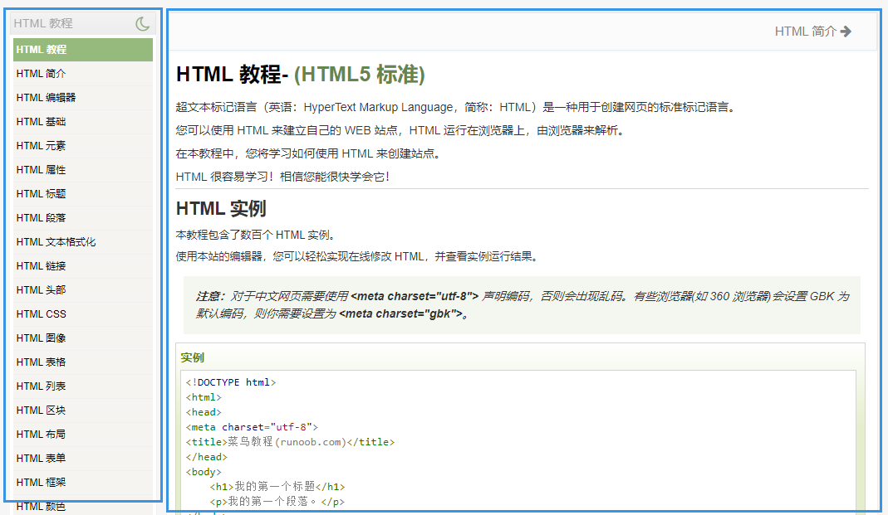

# 两列布局

## 什么是两列布局



如图所示，左列宽度固定，右列宽度是自适应的（自动铺满）的布局就是两列布局。类似的，右列宽度固定，左列宽度自适应（自动铺满）也是二列布局。

## 实现

1. float+margin

   html:
   ```html
   <body>
      <div id="left"></div>
      <div id="right"></div>
   </body>
   ```
   css:
   ```css
   #left {
      background-color: #ccc;
      float: left;
      width: 100px;
      height: 500px;
   }
   #right {
      background-color: #eee;
      height: 500px;
      margin-left: 100px; /*大于等于#left的宽度*/
   }
   ```
   效果：两列布局-float.html
   
2. 绝对定位

   html:

   ```html
   <body>
       <div id="root">
           <div id="left"></div>
      		<div id="right"></div>
       </div>
   </body>
   ```

   css:

   ```css
   #root{
       position: ralative;
   }
   #left {
       position: absolute;
      	background-color: #ccc;
       width: 100px;
       height: 500px;
       top: 0;
       left: 0;
   }
   #right {
       position: absolute;
      	background-color: #eee;
      	height: 500px;
      	top: 0;
       left: 100px;
       right: 0;
   }
   ```

   效果：两列布局-absolute.html

3. flex

   html:

   ```html
   <body>
       <div id="root">
           <div id="left"></div>
      		<div id="right"></div>
       </div>
   </body>
   ```

   css:

   ```css
   #root{
       display: flex;
   }
   #left {
      	background-color: #ccc;
       width: 100px;
       height: 500px;
   }
   #right {
       flex: 1;
      	background-color: #eee;
      	height: 500px;
   }
   ```

   效果：两列布局-flex.html

