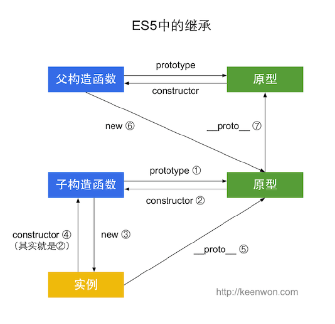
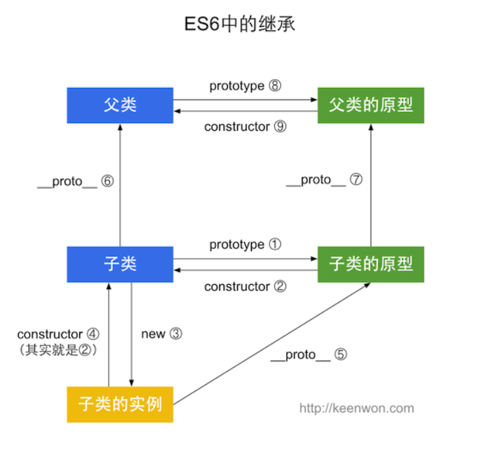

# 各种继承
## 原型链继承
```js
function Super(){}
function Sub(){}
Sub.prototype = new Super();
Sub.prototype.constructor = Sub;
```

关系检测：

```js
new Sub() instanceof Sub;//true
new Sub() instanceof Super;//true
new Super() instanceof Super;//true
```

缺点：

1. 无法调用父级构造函数
2. 属性没有独立

## 借用构造函数

```js
function Super(){}
function Sub(){
  Super.call(this);
}
```

关系检测：

```js
new Sub() instanceof Sub;//true
new Sub() instanceof Super;//false
new Super() instanceof Super;//true
```

缺点：

1. 方法没有共享

## 组合式继承

```js
function Super(){}
function Sub(){
  Super.call(this);
}
Sub.prototype = new Super();
Sub.prototype.construtor = Sub;
```

关系检测：

```js
new Sub() instanceof Sub;//true
new Sub() instanceof Super;//true
new Super() instanceof Super;//true
```

缺点：

1. 父类构造函数被执行两遍

## 原型式继承

这是一个特殊的继承形式，它不依赖于构造函数。

```js
function createObj(prototype) {//也就是Object.create
  function F() {}
  F.prototype = prototype;
  return new F();
}

function createAnother(original) {
    // 通过调用函数创建一个新对象
    var clone = object(original);  
    // 以某种方式来增强这个对象
    clone.sayHi = function() {
        alert("hi");
    }

    return clone;
}

var person = {
    name: "Bert",
    friends: ["Shelby", "Court", "Van"]
};

var anotherPerson = createAnother(person);
anotherPerson.sayHi(); // Hi
```

其思想就是直接新建一个以给定对象为原型的对象，然后对其增加属性以达到继承的效果

## 寄生组合式继承

```js
function inheritPrototype(subType, superType) {
    var prototype = Object.create(superType.prototype); // 创建对象
    prototype.constructor = subType; // 增强对象
    subType.prototype = prototype; // 指定对象
}

function SuperType(name) {
    this.name = name;
    this.colors = ["red", "blue", "green"];
}

SuperType.prototype.sayName = function() {
    alert(this.name);
}

function SubType(name, age) {
    SuperType.call(this, name);

    this.age = age;
}

inheritPrototype(SubType, SuperType);

SubType.prototype.sayAge = function( {
    alert(this.age);
})
```

最主要的思想就是用`inheritPrototype`这个函数避免了prototype = new Super()时调用父类

## 判断继承关系的方法

1. `构造函数.prototype.isPrototypeOf(实例对象)`

    返回bool值

2. `实例对象 instanceof 构造函数`

    返回bool值

## 引申
ES5的继承

ES6的继承


