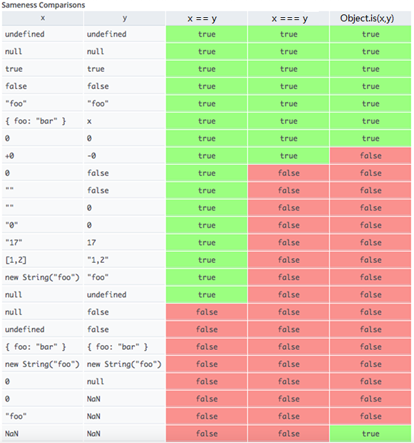

# ES5下的隐式类型转换

> 类型错误出现的时机
> 1. 调用非函数
> 2. 读取null或者undefined的属性


## `-`、`*`、`/`、`%`的类型转换规则

 `-`、`*`、`/`、`%`的隐式转换都遵循将操作数转化为数字

## `+`的类型转换规则

## `<``>``<=``>=`的类型转换规则

## `!`的类型转换规则

## `&``|``^`的转换规则

## `==`和`!=`的类型转换规则

1. 空值检测：空值(null和undefined) != 非空值(除了null、undefined)
```js
null == ""//false
null == 0 //false
null == false //false
null == NaN//false
//但是
null == undefined //true
//注意非空值之间不一定可以==
```
2. 数值比较：操作数中出现了Number类型或者**Boolean**类型，就会把另外一个操作数转化为数字（上述null、undefined除外，即：number、boolean、string、object）
```js
[] == false//结果：true 
//首先有boolean出现，false转化为0，那么[]需要转化为数字
//对象转为数字的步骤如下：
//[]需要.valueOf()，得到数组自身,发现还不是基本数据类型那么：
//接着调用toString()得到`""`，发现虽然是基本数据类型了，但是不是数字类型，
//接着转化为数字：空字符串为0，最后得到true
{} == false//结果：false 
//首先首先有boolean出现，false转化为0，
//而对象需要转化为数字：
//调用valueOf()，返回对象本身
//调用toString()，返回字符串"[object Object]"
//转化为数字:NaN（!!!!NaN是Number类型的特殊值!!!!）
//返回false
```
3. 字符串比较：操作数出现了字符串，另外一个操作数转化为字符串（上述null、undefined、boolean、number除外即：string、object）。结果就是比较各位的charCodeAt()

4. 对象比较：操作数中出现了对象，另外一个操作数也为对象。结果就是直接比较引用

## `===`和`!==`的转化规则

无。进行严格检查。

## `if(...)`转化规则

转化为true的：

1. true
2. 非空字符串类型
3. 非零非NaN数字类型（包括Infinity）
4. null不能转化为true
5. undefined不能转化为true
6. 任何对象类型

转化为false的：
1. false
2. 空字符串
3. 0或者NaN
4. null
5. undefined
6. 对象不能转化为false

## `&&``||`的转换规则

## Boolean()

## Null()

## Undefined()

## Number()

## String()

## Object()

## 类型检测请参考`Blog/JS/模拟实现/myTypeof.js`

## 其他



