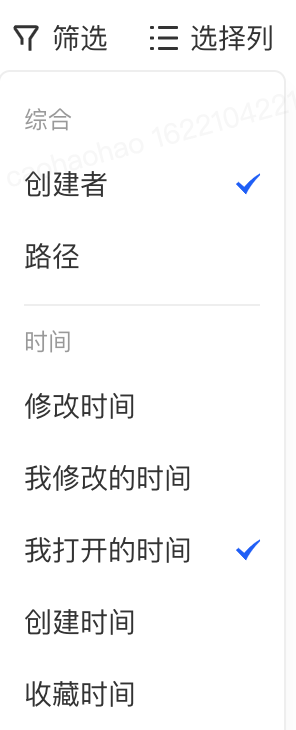
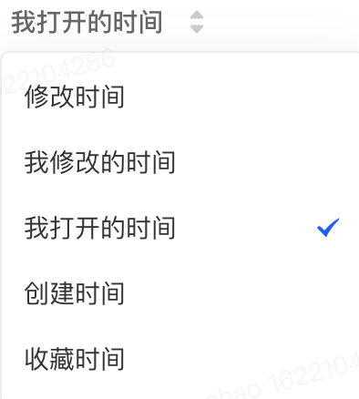

<!--
 * @Description: 
 * @Author: caohaohao
 * @Date: 2021-05-06 17:36:47
 * @LastEditTime: 2021-05-18 21:26:19
 * @LastEditors: caohaohao
-->
# 实习期间我学到了什么

## 在项目中找某一个组件

1. 可以通过元素检查、通过类名全局搜索

2. devtools的自带检查工具（react）

3. 搜索文案

## 在项目中看一个组件还有没有在用

1. 直接通过查找引用查看（当涉及路由页时不太好查）

2. 全局搜索组件名，查找引用

3. 注释掉，查看报错信息

4. devtool里面查找组件名

## 良好的代码编写习惯

1. 需要对props做检查和兼容性处理，否则会出现问题（比如有时候报错chrome不直接挂掉页面但是Safari就直接挂掉页面了）

2. 尽可能依赖TS的类型推导

3. 少用自定义事件、localStorage，因为随着项目增大会变得不可控

4. 能少写state就少写，比如有三个树根只能展开一个，那么我们应该用1个变量存应该打开哪个，而不是存三个变量来修改，这样做一来可以减少内存占用，二来后期有其他相关逻辑就不好维护了

## 组件拆分的注意事项

1. 拆出来的新组件是否和原组件在同一级，如果不在，需要确认这不会影响整体逻辑

2. 拆出来的新组件是否和原组件在页面内的复用次数上有区别，如果有区别，需要确保不会有冗余的重复逻辑，解决办法可以是将哪些可能冗余重复的逻辑保留在原组件中

## 函数式组件相关注意事项

1. 尽量不要将不可变的变量在函数、函数内赋值，应该放在函数外，因为react每次渲染都会重新执行函数

2. 相同的useEffect应该汇集在一起，一来减少开销，二来如果后期代码维护，将两个useEffect相对顺序颠倒会引出bug

3. 在useEffect里进行事件监听、EventCenter.on等时，不要忘记在返回的函数中取消，因为函数是被执行多遍的，没被清楚掉的函数会闭包上层变量，内存泄漏会比较严重

## 从redux流入的数据进行清洗时，应该先克隆再清洗

    > 清洗是指对原数据进行修改后使用

## 大型项目工作流

见`项目实践经验`

## 国际化方案调整

原来的国际化方案：我们维护了一个谷歌表格，用于各个项目的翻译工作，之所以这么做是因为翻译工作者一般在国外，另外有了产品、运营与开发的沟通平台。

工作流为：脚本工具通过词法分析分析出中文块，将其导出到谷歌表格中，翻译工作者进行翻译，之后用脚本工具进行导入操作。导入操作会把中文块用国际化方法包起来，同时更新国际化语料json文件

值得一提的是，我们这个国际化脚本支持动态填值，使用方法为\`${}\`语法，之后里面的变量会被放在`intl.t`的第二个参数

发现问题：同一个中文key可能会在不同的地方有不同的翻译，所以需要对他们进行区分，方法就是给每一个中文key加上一个context属性（表格中体现为加了一个context列），之后在具体的代码中的`intl.t`中加入对应的context参数

## 遇到的困难

1. 多`多步新手引导`协同

    需求：主页面下面有控制子路由的一组按钮，子路由负责切换主页面下的部分内容，也就是说这些路由控制按钮不在子路由的页面里。我们现在需要对左侧`子路由控制按钮组`进行一个多步新手引导（以下称`新引导`），同时，在某一个子路由页面中已经有另一个新手引导了（以下称`旧引导`）。新引导的优先级要低于旧引导。

    难点：情况比较烦杂。

    解决过程：如果一直分情况讨论由于影响因素较多，我们选择将两个manager再由上层一个模块统一控制，然后最后统一在组件内调用上层模块导出的api，他们接受到受影响的因素作为传参。让繁杂的相互制约放在内部，这样就很好的做到了高内聚低耦合。

    难点：两个新手引导的manager的加载顺序不好确认

    解决方案：查阅资料，自己打印，了解了两个新手引导的加载顺序，以及对其顺序进行控制

2. 重构表格组件的排序按钮以及可选择的列

之前

修改后

难点：

之前：

之后：

